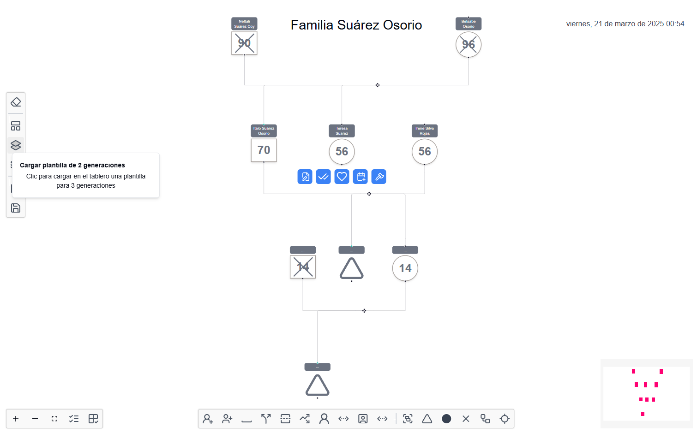

# Genealogical chart

Familiarization in vite with react flow and typescript

# Introduction to the Family Tree Design Resource

This tool provides a utility for the construction of family diagrams and ecomaps in the app external module.



========================================================================

## Technologies

Web Tool - Node-React-Vite-ReactFlow

## Other settings in the project

|   <!-- -->   | <!--   -->  |    <!-- -->    |
| :----------: | :---------: | :------------: |
|    _React_   | _Prettier_  |    _moment_    |
|   _Eslint_   |    _Git_    |  _Typescript_  |
|    _Vite_    | _ReactFlow_ |   _TailWind_   |

## Starting 🚀

_These instructions will allow you to get a copy of the project running on the local machine for development._

See **Deployment** to learn how to deploy the project.

### Pre-requirements 📋

- _NodeJS_ current version
- _React_ current version
- _TypeScript_ current version
- _ReactFlow_ current version

##### Recommended 📋

- _Hyper_
- _VsCode_
- _GitHub Desktop_

### Installation 🔧

**To install the project locally and run the API please execute the following steps**

_Clone the tree-family repository from GitHub_

```
git clone https://github.com/SUROS-mia/tree-family.git
```

_Install the dependencies_

```
npm i
```

_Compile the project and start the server_

```
npm run dev
```

_Invoke the service status_

```
http://localhost:5173
```

## Deployment 📦

_Compile the project and build the application sources_

```
npm run build 
```

## Built with 🛠️

_Tools and Technologies used_

- [Nodejs](https://nodejs.org/en/) - Server-side JavaScript environment, uses an asynchronous and event-driven model
- [Vite](https://vite.dev/) - Fast and minimalist web framework with react
- [Npm](https://www.npmjs.com/) - Dependency manager
- [ReactFlow](https://reactflow.dev/) - Lib for nodes use 

## Contributing 🖇️

Contributions are currently not allowed.

## Versioned 📌

[SemVer](http://semver.org/) is used for versioning. For all versions available.

## Authors ✒️

_Built by_

- **Yovany Suárez Silva** - _Senior Full Stack Developer_ - [desobsesor](https://github.com/desobsesor)

## License 📄

This project is under the MIT License - see the file [LICENSE.md](LICENSE.md) for details

## Expressions of Gratitude 🎁

⌨️ con ❤️ por [desobsesor](https://github.com/desobsesor) 😊 with the help of AI